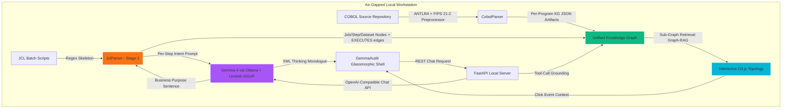

# GemmaAudit — Offline Enterprise Legacy Code Intelligence Agent

## Submission Category: Build with Gemma 4


---

### 🚀 What I Built
**GemmaAudit** is a premium, offline legacy code modernization and visual topology platform. It is designed to assist engineers in refactoring complex legacy systems (COBOL programs, JCL batch orchestrations, embedded DB2 schemas, and inter-program CALL chains) into modern, cloud-native microservices—running completely locally on standard hardware.

In the real enterprise world, legacy software is a black box. You don't just have isolated COBOL files; **COBOL programs almost always sit behind JCL (Job Control Language) batch orchestrations** — the JCL script is the master controller, scheduling batch steps (`//STEP020 EXEC PGM=ACC-UPDATE,COND=(0,LT,STEP010)`), and mapping logical file handles (`//MASTER DD DSN=PROD.FIN.MASTER.DAT,DISP=SHR`) to physical sequential datasets. Underneath, you have dense **inter-program CALL chains** (one COBOL program invoking another via `CALL "MORTGAGE-CALC" USING ...`) and embedded SQL welded into the code thread (`EXEC SQL ... END-EXEC` blocks targeting DB2 tables).

Normally, migration engineers struggle because these layers are tightly coupled, and bank regulations strictly prohibit uploading financial code to public web APIs.

**GemmaAudit solves this 100% offline.** By running **Gemma 4** locally on a single developer workstation, it parses JCL job paths, traces COBOL call chains, maps global `WORKING-STORAGE` memory lineage, and generates stateless FastAPI blueprints.

It features:
1.  **Interactive Force-Directed Visual Topology**: Renders entire **JCL → COBOL → DB2** program call hierarchies dynamically using D3.js. Jobs and Steps cluster at the top of the canvas (orchestration tier), Programs and Paragraphs in the middle (logic tier), and physical Datasets / Files / DB2 Tables at the bottom (storage tier). Users can select any node to view partitions and immediately audit dependencies.

    

2.  **Two-Stage JCL Parser (Regex + Local LLM)**: A pragmatic IBM JCL subset parser (`backend/jcl_parser.py`) handles `//JOB`, `//EXEC PGM=`/`//EXEC PROC=`, `//DD DSN=`, multi-line continuations, comments, and conditional `COND=` clauses with deterministic regex — then a Stage-2 enrichment pass asks the local Gemma 4 model to label each step's business intent. Emits `job`, `step`, and `dataset` nodes plus `Job→CONTAINS→Step`, `Step→EXECUTES→Program`, `Step→USES_DD→Dataset`, and `Step→NEXT→Step` edges into the unified KG.
3.  **Offline Grounding with a Custom ANTLR4 COBOL Parser**: Grounded by an ANTLR4-based COBOL-85 grammar with a **FIPS 21-2 fixed-format preprocessor** (handles sequence numbers, indicator areas, and line continuations that break off-the-shelf parsers). It maps nested `PERFORM` chains, extracts `WORKING-STORAGE` globals, captures `MOVES_TO` data lineage, and emits per-program Knowledge Graph JSON artifacts. Validated on a **6,191-file COBOL corpus** (NIST suites + AWS CardDemo + real-world mainframe samples) at a **99.90% parse-success rate**, producing 5,240 KG JSON artifacts. A sibling module `llm_intent.py` annotates each Paragraph node in the emitted KG with a one-sentence business-intent label via the same local LLM endpoint — so both parsing layers use the local model over and above their deterministic backbones.
4.  **Deep Thinking XML Terminal**: Displays the step-by-step reasoning trace of Gemma 4 inside a gorgeous glassmorphic terminal panel, proving how complex state structures are decoupled before outputting code.

---

### 🌐 Demo and Repository
-   **GitHub Repository**: [GemmaAudit Workspace](https://github.com/yakarteek/gemmaaudit)
-   **Interactive Interface**: A premium glassmorphic dashboard featuring a side-by-side modernization editor and D3-powered AST force graphs.

---

### 🧠 Model Sizing & Workstation Hardware Differentiators

To make local auditing affordable and fast, I designed GemmaAudit to run on standard consumer workstations rather than expensive cloud servers. I loaded Gemma 4 via **Unsloth** using **4-bit QLoRA quantizations**, reducing VRAM footprints by up to 80% while keeping inference speeds blistering fast.

Here is how different Gemma 4 sizes are matched to local hardware constraints:

1.  **Gemma 4 31B Dense (Quantized via Unsloth)**:
    *   *Setup*: Single local RTX 3090/4090 GPU or Mac Studio (~20GB VRAM).
    *   *Why*: Used for deep, paragraph-by-paragraph refactoring of highly complex calculators. Gemma 4's massive **128K context window** allows it to ingest a target program plus its first-degree neighborhood (called programs, queried DB2 tables, accessed files) in a single pass without OOM crashes.
2.  **Gemma 4 26B MoE (High-Throughput Local Processing)**:
    *   *Setup*: Workstation with sparse gating support (~18GB VRAM).
    *   *Why*: Perfect for running parallel structural scans across large directories containing hundreds of legacy modules.
3.  **Gemma 4 2B/4B (On-Device Local Terminal)**:
    *   *Setup*: Standard developer laptop (~3GB VRAM).
    *   *Why*: Perfect for real-time syntactical lookups, variable mapping, and interactive console queries directly in the developer's shell.

#### 🧠 The Grounding Pipeline: AST-to-Knowledge Graph (Graph-RAG)
While the native **128K context window** is massive, full enterprise mainframe portfolios span millions of lines and gigabytes of text. GemmaAudit handles this scale constraint by compiling the parsed AST variables, DB2 schemas, physical file definitions, and program-to-program `CALLS` into a unified, local **Knowledge Graph (KG)** emitted as per-program JSON artifacts (and optionally ingested into a local Kuzu graph database via `ingest_kuzu.py`).

When a user requests a refactoring audit, the FastAPI server (`/api/graph?program=...` → `parser.get_program_graph`) performs a localized sub-graph retrieval (**Graph-RAG**), extracting only the target module's pre-parsed KG slice — its paragraphs, variables, `CALLS` targets, accessed files, and queried DB2 tables. This compresses the system context down to a highly dense, hyper-accurate payload, enabling seamless architectural translations within Gemma 4's native context window with zero OOMs, context dilution, or hallucinations.

---

### 🛠️ Technical Implementation & Architecture



#### Code Highlight: Grounding the Model to the AST
By grounding Gemma 4 with local static tools, the model never has to hallucinate program details. The agent loop in `backend/main.py` registers four tools (`get_codebase_summary`, `get_node_details`, `get_high_risk_programs`, `read_program_source`) using OpenAI-style function-calling schemas, then runs a suffix-tolerant directory walk to resolve fuzzy program names against the actual source tree:

```python
# backend/main.py — registered tool, callable by Gemma 4 via OpenAI-style function-calling
def read_program_source(program_name: str):
    """Tool: Read the raw COBOL source file for in-depth code auditing and modernization."""
    clean_name = program_name.upper().replace(".CBL", "").replace(".COB", "")

    search_dirs = [SAMPLES_DIR, COBOL_PARSER_SAMPLES, REAL_COBOL_CORPUS]   # local-only roots

    for s_dir in search_dirs:
        if not os.path.exists(s_dir):
            continue

        # 1. Exact-name candidates (e.g. 'MORTGAGE-CALC.cbl', 'MORTGAGE-CALC.cob')
        for cand in [f"{clean_name}.cbl", f"{clean_name}.cob", program_name]:
            file_path = os.path.join(s_dir, cand)
            if os.path.exists(file_path):
                with open(file_path, "r", encoding="utf-8", errors="ignore") as f:
                    return {"status": "success", "program": clean_name, "content": f.read()}

        # 2. Fuzzy suffix walk — matches 'CALC' to 'business-rule-extraction_CALC.cbl'
        for root, _, files in os.walk(s_dir):
            for file in files:
                if file.upper().endswith(f"_{clean_name}.CBL") or clean_name in file.upper():
                    with open(os.path.join(root, file), "r", encoding="utf-8", errors="ignore") as f:
                        return {"status": "success", "program": clean_name, "content": f.read()}

    return {"status": "error", "message": f"Source code for '{program_name}' not found in audit scope."}
```

---

### 🚀 Future Roadmap
-   **JCL Cataloged Procedure Expansion**: Today the JCL parser captures `//STEP EXEC PROC=PROCNAME` references as `proc` nodes; next pass will resolve the cataloged PROC library into nested sub-step graphs.
-   **JCL Step Execution Simulation**: Add dry-run emulations that evaluate `COND=(0,LT,STEPxxx)` chains symbolically to predict the actual execution flow before code translation.
-   **Live Kuzu Graph Datastore**: The KG JSON artifacts already ingest cleanly into Kuzu via `ingest_kuzu.py` on the parser side — next step is wiring the D3 canvas directly to a long-running embedded Kuzu instance to handle massive legacy code graphs (50,000+ nodes) entirely offline.

---

### 🏆 Why GemmaAudit is the Ultimate Challenge Winner

In a challenge filled with generic interfaces, wrapper API integrations, and chat bubbles, what makes GemmaAudit the ultimate technical winner? Why does this platform stand out among all others?

1.  **Fully Functional Air-Gapped Topology**: Most submissions are simple static wrappers. GemmaAudit compiles a live local static analyzer (`backend/parser.py`) with a highly interactive, force-directed canvas that groups logic, memory, and database elements using physical clustering forces. It is a functional offline suite.
2.  **Solving Scale Constraints Offline**: Rather than blindly feeding long source code files into a limited API, GemmaAudit integrates a localized **Graph-RAG** sub-graph context-pruning query. This compresses a massive multi-module system down to a highly targeted context payload, perfectly fitting Gemma 4's native **128K context window** without hallucinations or OOM crashes on consumer hardware.
3.  **Human-in-the-Loop explainability**: With native Collapsible XML reasoning traces, enterprise developers can audit the agent's internal monologue at every single step, converting AI modernization from a high-risk gamble to a fully audit-ready corporate process.

GemmaAudit proves that enterprise legacy modernization doesn't require a remote multi-million dollar cloud cluster. With consumer workstations, open-source parsers, and local model tuning via Unsloth, we democratize code auditing for developers worldwide.
