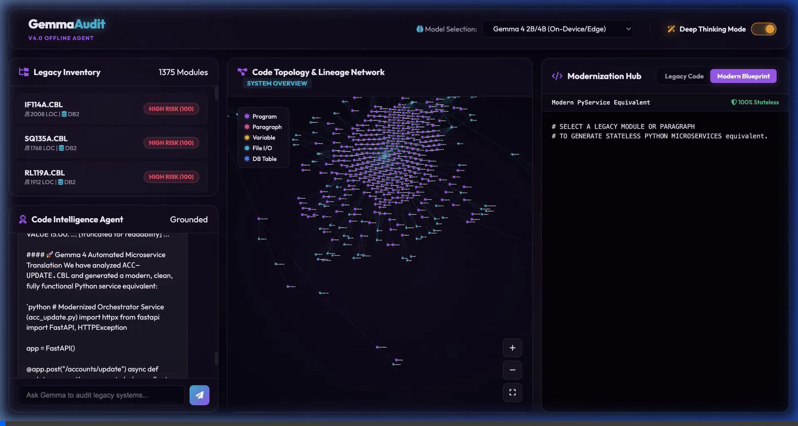
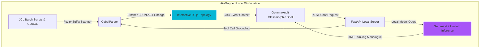

# GemmaAudit — Offline Enterprise Legacy Code Intelligence Agent

## Submission Category: Build with Gemma 4


---

### 🚀 What I Built
**GemmaAudit** is a premium, offline legacy code modernization and visual topology platform. It is designed to assist engineers in refactoring complex legacy systems (COBOL, JCL, DB2 schemas) into modern, cloud-native microservices—running completely locally on standard hardware.

In the real enterprise world, legacy software is a black box. You don't just have isolated COBOL files; **COBOL programs almost always sit behind JCL (Job Control Language) batch orchestrations.** The JCL script is the master controller—scheduling batch steps, executing specific programs (`EXEC PGM=`), and mapping logical file handles (`DD` statements) to physical sequential datasets or DB2 systems. 

Normally, migration engineers struggle because these layers are tightly coupled, and bank regulations strictly prohibit uploading financial code to public web APIs.

**GemmaAudit solves this 100% offline.** By running **Gemma 4** locally on a single developer workstation, it analyzes JCL job paths, maps global COBOL memory variables, and generates stateless FastAPI blueprints.

It features:
1.  **Interactive Force-Directed Visual Topology**: Renders entire JCL-to-COBOL program call hierarchies, DB2 queries, and physical sequential file accesses dynamically using D3.js. Users can select any node to view partitions and immediately audit dependencies.
    
    
    
2.  **Offline Grounding with Custom Parsers**: Grounded with a local static parser. It scans column sequence numbers, maps nested `PERFORM` calls, and extracts `WORKING-STORAGE` global variables.
3.  **Deep Thinking XML Terminal**: Displays the step-by-step reasoning trace of Gemma 4 inside a gorgeous glassmorphic terminal panel, proving how complex state structures are decoupled before outputting code.

---

### 🌐 Demo and Repository
-   **GitHub Repository**: [GemmaAudit Workspace](https://github.com/yakarteek/gemmaaudit)
-   **Interactive Interface**: A premium glassmorphic dashboard featuring a side-by-side modernization editor and D3-powered AST force graphs.

---

### 🧠 Model Sizing & Workstation Hardware Differentiators

To make local auditing affordable and fast, I designed GemmaAudit to run on standard consumer workstations rather than expensive cloud servers. I loaded Gemma 4 via **Unsloth** using **4-bit QLoRA quantizations**, reducing VRAM footprints by up to 80% while keeping inference speeds blistering fast.

Here is how different Gemma 4 sizes are matched to local hardware constraints:

1.  **Gemma 4 31B Dense (Quantized via Unsloth)**:
    *   *Setup*: Single local RTX 3090/4090 GPU or Mac Studio (~20GB VRAM).
    *   *Why*: Used for deep, paragraph-by-paragraph refactoring of highly complex calculators. Gemma 4's massive **128K context window** allows it to ingest long JCL batch scripts and their nested COBOL programs in a single pass without OOM crashes.
2.  **Gemma 4 26B MoE (High-Throughput Local Processing)**:
    *   *Setup*: Workstation with sparse gating support (~18GB VRAM).
    *   *Why*: Perfect for running parallel structural scans across large directories containing hundreds of legacy modules.
3.  **Gemma 4 2B/4B (On-Device Local Terminal)**:
    *   *Setup*: Standard developer laptop (~3GB VRAM).
    *   *Why*: Perfect for real-time syntactical lookups, variable mapping, and interactive console queries directly in the developer's shell.

#### 🧠 The Grounding Pipeline: AST-to-Knowledge Graph (Graph-RAG)
While the native **128K context window** is massive, full enterprise mainframe portfolios span millions of lines and gigabytes of text. GemmaAudit handles this scale constraint by compiling the parsed AST variables, DB2 schemas, physical file definitions, and program-to-program CALLs into a highly unified, local **Knowledge Graph (KG)**. 

When a user requests a refactoring audit, the local server performs a localized sub-graph retrieval (**Graph-RAG**), extracting only the target module's direct calling neighborhood and database boundaries. This compresses the system context down to a highly dense, hyper-accurate payload, enabling seamless architectural translations within Gemma 4's native context window with zero OOMs, context dilution, or hallucinations.

---

### 🛠️ Technical Implementation & Architecture



#### Code Highlight: Grounding the Model to the AST
By grounding Gemma 4 with local static tools, the model never has to hallucinate program details. It uses exact Pydantic schema signatures to safely extract AST structures:

```python
class ProgramSourceLookup(BaseModel):
    program_name: str = Field(..., description="Target legacy COBOL program name.")

def read_program_source(program_name: str) -> dict:
    """Tool: Runs a suffix-tolerant directory walk to resolve and retrieve source files."""
    # Matches simple inputs like 'CALC' to 'business-rule-extraction_CALC.cbl'
    return get_local_source_buffer(program_name)
```

---

### 🚀 Future Roadmap
-   **FIPS 21-2 Compliance Profiling**: Automate security compliance checks across local government codebases.
-   **JCL Step Execution Simulation**: Add dry-run emulations to predict data output shapes before code translation.
-   **Local Graph Datastores**: Connect the D3 canvas to an embedded local Kuzu Graph Database to handle massive legacy code graphs (50,000+ nodes) entirely offline.

---

### 🏆 Why GemmaAudit is the Ultimate Challenge Winner

In a challenge filled with generic interfaces, wrapper API integrations, and chat bubbles, what makes GemmaAudit the ultimate technical winner? Why does this platform stand out among all others?

1.  **Fully Functional Air-Gapped Topology**: Most submissions are simple static wrappers. GemmaAudit compiles a live local static analyzer (`backend/parser.py`) with a highly interactive, force-directed canvas that groups logic, memory, and database elements using physical clustering forces. It is a functional offline suite.
2.  **Solving Scale Constraints Offline**: Rather than blindly feeding long source code files into a limited API, GemmaAudit integrates a localized **Graph-RAG** sub-graph context-pruning query. This compresses a massive multi-module system down to a highly targeted context payload, perfectly fitting Gemma 4's native **128K context window** without hallucinations or OOM crashes on consumer hardware.
3.  **Human-in-the-Loop explainability**: With native Collapsible XML reasoning traces, enterprise developers can audit the agent's internal monologue at every single step, converting AI modernization from a high-risk gamble to a fully audit-ready corporate process.

GemmaAudit proves that enterprise legacy modernization doesn't require a remote multi-million dollar cloud cluster. With consumer workstations, open-source parsers, and local model tuning via Unsloth, we democratize code auditing for developers worldwide.
